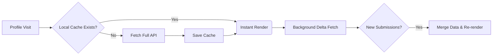

# Codeforces Daily Momentum

An extension that injects interactive activity graphs into your Codeforces profile to track consistency, solve volume, and performance trends over time.

## ⚙️ Architecture

We use a **Stale-While-Revalidate** caching strategy to ensure instant loading without spamming the Codeforces API.

## 📊 The Analytics Engine

### Momentum Point System
Points are calculated using an exponential formula based on problem difficulty over the **last 30 days**:
**Formula**: `Σ 2^(Rating/200)` *(e.g., 1600 rating = 256 pts)*

| Points Required | Momentum Rank | Color |
|---|---|---|
| **35,000+** | Legendary Grandmaster | Dark Red |
| **20,000+** | Grandmaster | Red |
| **12,000+** | Master | Orange |
| **6,000+** | Candidate Master | Purple |
| **2,500+** | Expert | Blue |
| **1,000+** | Specialist | Cyan |
| **300+** | Pupil | Green |
| **> 0** | Newbie | Gray |

**Approximate Problems Required (in 30 days) by Rating:**

| Rating | Pupil (300) | Spec (1k) | Exp (2.5k) | CM (6k) | Mas (12k) | GM (20k) | LGM (35k) |
|---|---|---|---|---|---|---|---|
| **800** | 19 | 63 | 157 | 375 | 750 | 1250 | 2188 |
| **1000** | 10 | 32 | 79 | 188 | 375 | 625 | 1094 |
| **1200** | 5 | 16 | 40 | 94 | 188 | 313 | 547 |
| **1400** | 3 | 8 | 20 | 47 | 94 | 157 | 274 |
| **1600** | 2 | 4 | 10 | 24 | 47 | 79 | 137 |
| **1800** | 1 | 2 | 5 | 12 | 24 | 40 | 69 |
| **2000** | 1 | 1 | 3 | 6 | 12 | 20 | 35 |
| **2200** | 1 | 1 | 2 | 3 | 6 | 10 | 18 |
| **2400** | 1 | 1 | 1 | 2 | 3 | 5 | 9 |
| **2600** | 1 | 1 | 1 | 1 | 2 | 3 | 5 |
| **2800** | 1 | 1 | 1 | 1 | 1 | 2 | 3 |
| **3000** | 1 | 1 | 1 | 1 | 1 | 1 | 2 |
| **3500** | 1 | 1 | 1 | 1 | 1 | 1 | 1 |

### Rating Estimation Heuristic
If the API drops the problem rating, we use historical averages based on the contest division and index as a fallback:

| Division | A | B | C | D | E | F | G | H |
|---|---|---|---|---|---|---|---|---|
| **Div. 1** | 1500 | 1900 | 2300 | 2700 | 3000 | - | - | - |
| **Div. 2 / Edu / Global** | 800 | 1000 | 1300 | 1600 | 1900 | 2200 | 2500 | - |
| **Div. 3** | 800 | 900 | 1100 | 1300 | 1500 | 1700 | 1900 | - |
| **Div. 4** | 800 | 800 | 900 | 1100 | 1300 | 1500 | 1700 | 1900 |

### Parameters Tracking
| Parameter | Details |
|---|---|
| **API Endpoints** | `user.status?count=200` (Delta), `contest.list` (Dictionary) |
| **Storage** | `chrome.storage.local` (`cfData_{handle}`) |
| **Deduplication** | Tracks unique problems via `contestId-index` where `verdict == "OK"` |
| **30-Day Momentum** | Rolling sum of unique problems solved over a 30-day window |
| **7-Day Trend** | Average daily solves over a 7-day sliding window |

## 🚀 Installation

- **[Install from the Chrome Web Store](https://chromewebstore.google.com/detail/hhefepkjfclhncgneofcnhhbhnldonon)** (Chrome, Edge, Brave)

#### Manual Install (Development / Firefox)
1. Clone this repository.
2. For Chrome: Go to `chrome://extensions/` > **Developer mode** > **Load unpacked** (select folder).
3. For Firefox: Go to `about:debugging#/runtime/this-firefox` > **Load Temporary Add-on** (select `manifest.json`).

## 📜 License & Privacy
- **Privacy:** 100% local. No data is sent to third-party servers.
- **License:** [MIT License](LICENSE)
